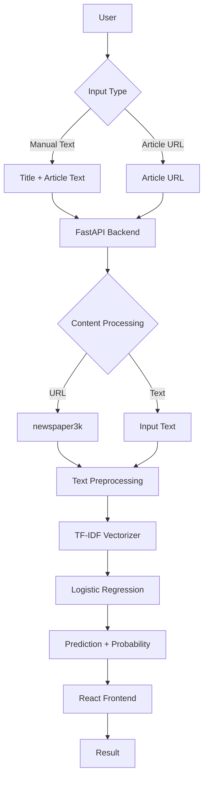
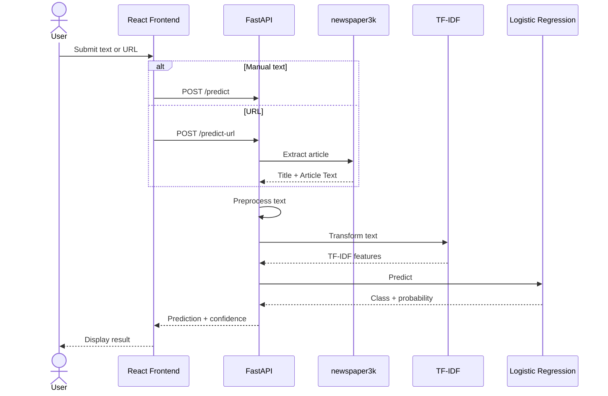

# Fake News Detection System

A full-stack machine learning application for classifying news articles as **Real** or **Fake** using Natural Language Processing (NLP), TF-IDF, and Logistic Regression.

The application supports both manual text input and article URLs. For URL-based predictions, the backend extracts the article content before passing it through the same preprocessing and classification pipeline used for manually entered text.

## Features

* Classifies manually entered news titles and article text.
* Accepts article URLs and extracts their content automatically.
* Returns a Real/Fake prediction with the model's probability score.
* Provides a React-based web interface.
* Provides REST API endpoints through FastAPI.
* Uses a pre-trained TF-IDF vectorizer and Logistic Regression model.
* Includes scripts and notebooks for dataset preparation and model training.
---


## System Architecture



---

## Machine Learning Pipeline

The model uses the following preprocessing and classification pipeline:


### Preprocessing

The title and article body are combined before preprocessing.

The following operations are performed:

* Convert text to lowercase.
* Remove punctuation and special characters using regular expressions.
* Remove English stopwords using NLTK.

### Feature Extraction

TF-IDF is used to convert the processed text into numerical features.

Configuration:

```text
max_features = 10000
```

### Classification

The classifier is Logistic Regression.

Configuration:

```text
max_iter = 1000
```

The labels are:

```text
0 = Real News
1 = Fake News
```

---

## Dataset

The model was trained on a combined dataset created from four publicly available datasets.

### Dataset Statistics

| Category  |    Articles | Percentage |
| --------- | ----------: | ---------: |
| Real News |      66,393 |      48.7% |
| Fake News |      70,044 |      51.3% |
| **Total** | **136,437** |   **100%** |

Average article length:

| Category  | Average Words |
| --------- | ------------: |
| Real News |          ~467 |
| Fake News |          ~444 |

### Dataset Sources

The raw datasets are not included in the repository. They can be downloaded from Kaggle.

1. **Fake and Real News Dataset**
   Contains `Fake.csv` and `True.csv`.

   https://www.kaggle.com/datasets/clmentbisaillon/fake-and-real-news-dataset

2. **WELFake Dataset**
   Contains `WELFake_Dataset.csv`.

   https://www.kaggle.com/datasets/saurabhshahane/fake-news-classification

3. **Fake News Dataset**
   Contains `fake_news_dataset.csv`.

   https://www.kaggle.com/datasets/mrisdal/fake-news

Check the respective dataset licenses before redistributing the raw datasets.

---

## Model Evaluation

The combined dataset was split into 80% training data and 20% testing data.

| Split     |    Articles |
| --------- | ----------: |
| Training  |     109,149 |
| Testing   |      27,288 |
| **Total** | **136,437** |

### Test Set Results

| Metric    | Real News | Fake News |   Overall  |
| --------- | :-------: | :-------: | :--------: |
| Accuracy  |     —     |     —     | **90.18%** |
| Precision |    0.90   |    0.91   |    0.90    |
| Recall    |    0.90   |    0.91   |    0.90    |
| F1-Score  |    0.90   |    0.90   |    0.90    |

The reported results are based on the 27,288-article test set.

### Probability Score

The application displays the probability returned by the Logistic Regression model.

For example:

```text
Prediction: FAKE
Probability: 88.70%
```

This represents the model's estimated probability for the predicted class. It does not represent the probability that the article is objectively true or false.

---

## Tech Stack

### Machine Learning

* Python
* Scikit-learn
* Pandas
* NLTK
* Joblib
* Regular Expressions
* Jupyter Notebook

### Backend

* FastAPI
* Uvicorn
* Pydantic
* newspaper3k

### Frontend

* React
* Vite
* JavaScript
* CSS

### Development

* Git
* GitHub
* VS Code
* Jupyter Notebook

---

## Project Structure

```text
News Detection/
│
├── backend/
│   ├── main.py
│   ├── fake_news_model.pkl
│   ├── tfidf_vectorizer.pkl
│   └── requirements.txt
│
├── frontend/
│   ├── src/
│   │   ├── api/
│   │   ├── components/
│   │   ├── App.jsx
│   │   └── main.jsx
│   ├── package.json
│   └── vite.config.js
│
├── News _dataset/
│   ├── merge.py
│   └── Merge_Data.ipynb
│
├── Fake_News.ipynb
├── .gitignore
├── LICENSE
└── README.md
```

---

## Installation

### Requirements

Install the following before setting up the project:

* Python 3.9 or later
* Node.js
* npm
* Git

---

## 1. Clone the Repository

```bash
git clone <repository-url>
cd "News Detection"
```

---

## 2. Prepare the Dataset

This step is only required if the model needs to be retrained.

Download the datasets listed above and place them in:

```text
News _dataset/
```

The directory should contain:

```text
News _dataset/
├── Fake.csv
├── True.csv
├── WELFake_Dataset.csv
└── fake_news_dataset.csv
```

Run the dataset merging script:

```bash
cd "News _dataset"
python merge.py
```

Alternatively, the `Merge_Data.ipynb` notebook can be used to perform the same process and inspect the dataset.

---

## 3. Backend Setup

Open a terminal in the project directory and navigate to the backend:

```bash
cd backend
```

Create a virtual environment:

```bash
python -m venv venv
```

### Windows

```bash
venv\Scripts\activate
```

### macOS / Linux

```bash
source venv/bin/activate
```

Install the dependencies:

```bash
pip install -r requirements.txt
```

Start the FastAPI server:

```bash
uvicorn main:app --reload
```

The backend will be available at:

```text
http://127.0.0.1:8000
```

FastAPI's interactive API documentation is available at:

```text
http://127.0.0.1:8000/docs
```

---

## 4. Frontend Setup

Open another terminal and navigate to the frontend:

```bash
cd frontend
```

Install the dependencies:

```bash
npm install
```

Start the Vite development server:

```bash
npm run dev
```

The frontend will normally be available at:

```text
http://localhost:5173
```

---

## API Reference

### `POST /predict`

Classifies manually provided article text.

#### Request

```json
{
  "title": "Article Title Here",
  "text": "Full article content here..."
}
```

#### Response

```json
{
  "prediction": "REAL",
  "confidence": 94.25
}
```

---

### `POST /predict-url`

Extracts an article from the provided URL and classifies it.

#### Request

```json
{
  "url": "https://example-news.com/sample-article"
}
```

#### Response

```json
{
  "prediction": "FAKE",
  "confidence": 88.70,
  "scraped_title": "Extracted News Title"
}
```

---

## API Flow



---

## Security and Data Handling

The repository does not contain API keys, passwords, or other private credentials.

The following files and directories are excluded from version control:

```text
*.csv
venv/
node_modules/
.env
```

The trained model and TF-IDF vectorizer are included because they are required to run the application without retraining the model.

---

## Limitations

The system has several limitations:

* Predictions depend on the quality and distribution of the training datasets.
* The model may perform poorly on topics or writing styles that are not well represented in the training data.
* A prediction can be incorrect even when the model reports a high probability.
* Some websites may not be extractable using `newspaper3k`.
* JavaScript-heavy or protected websites may prevent automatic article extraction.
* The system does not independently verify claims against external sources.
* The model is designed for classification and does not perform full fact-checking.

The predictions should therefore be treated as an automated classification result rather than a definitive assessment of an article's factual accuracy.

---

## Future Improvements

Possible improvements include:

* Transformer-based models such as BERT or RoBERTa.
* Explainable predictions using feature importance.
* Source credibility analysis.
* Integration with fact-checking APIs.
* Claim extraction and verification.
* Support for multiple languages.
* Better extraction of content from dynamic websites.
* Model versioning and experiment tracking.
* Automated model retraining.
* Docker-based deployment.
* Production logging and monitoring.

---

## License

This project is licensed under the MIT License.

See the [LICENSE](LICENSE) file for details.

---

## Disclaimer

This project is intended for educational and research purposes.

The predictions generated by the system should not be considered definitive evidence that a news article is true or false. Important claims should be verified using reliable sources and established fact-checking organizations.
